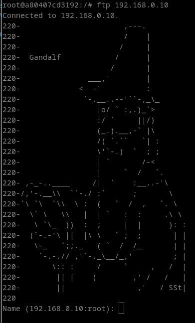
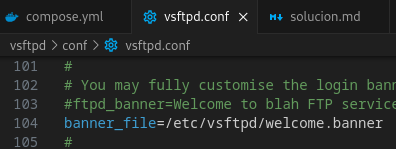
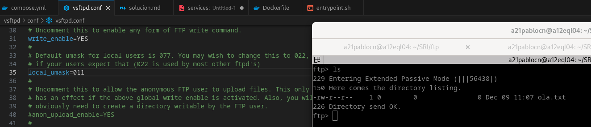
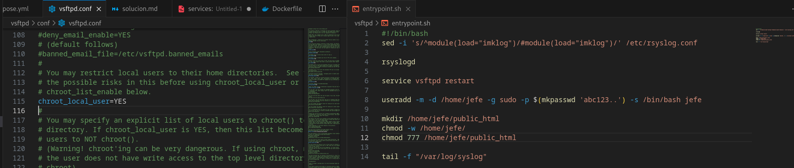
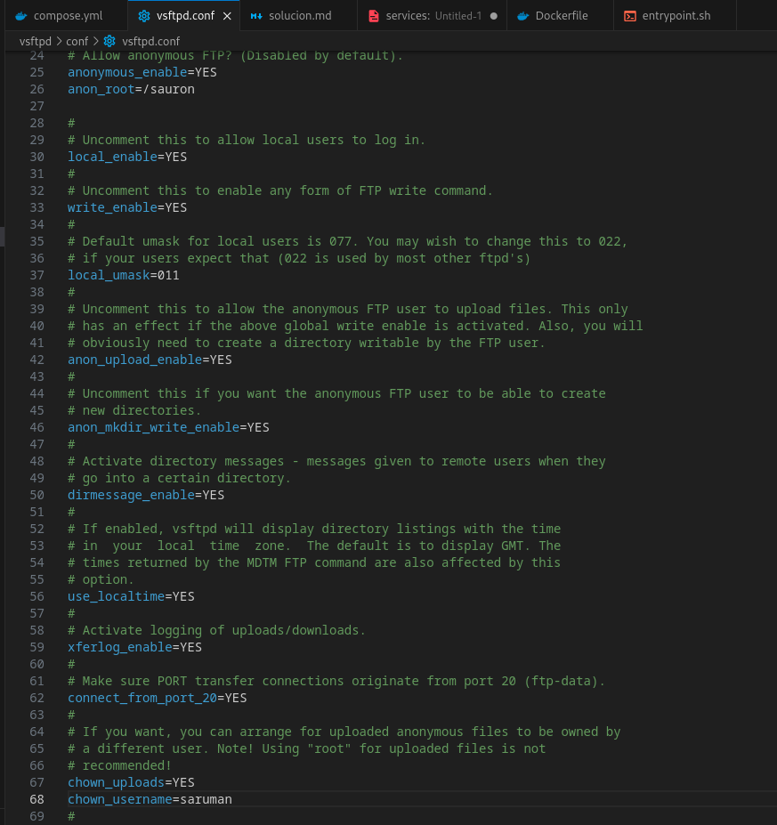
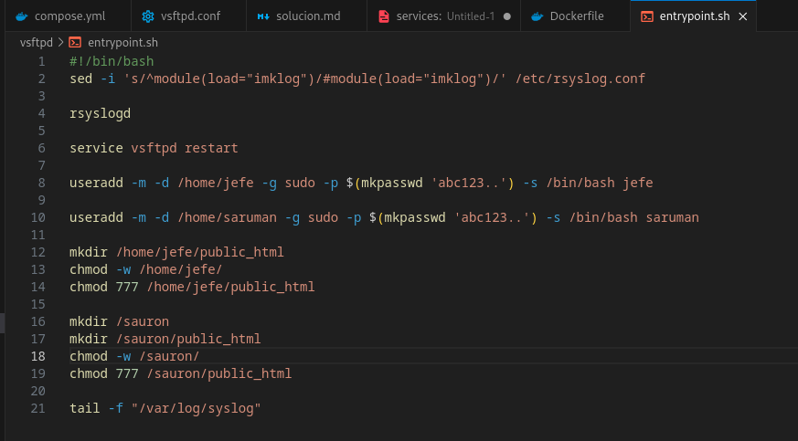
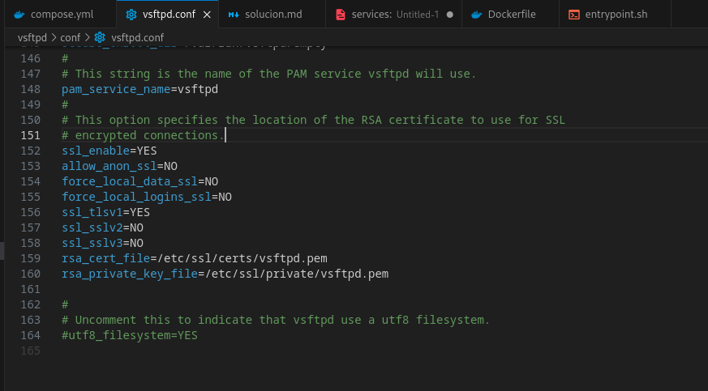
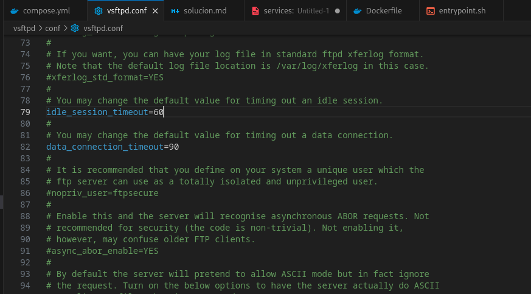
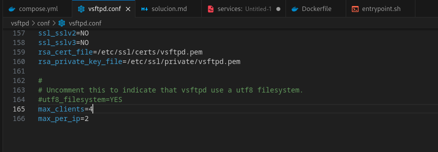
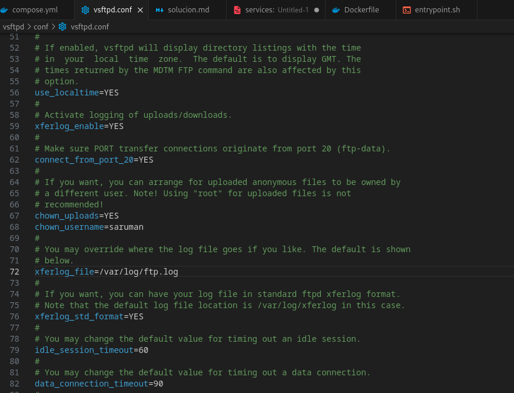

# Servidor FTP vsftpd
### 1. A mensaxe de benvida debe ser un ASCII Art da personaxe "Gandalf o Gris"

### 2. Habilita o permiso de escritura aos usuarios locais. Cando suban ficheiros, deben perder o permiso de execución para o grupo e para outros.

### 3. Impide o acceso de todos os usuarios locais fora do seu diectorio home permitindo que poidan escribir so no directorio public_html do seu directorio home.

### 4. Habilita o acceso anónimo no directorio /sauron, permitindo subir ficheiros e crear directorios. O propietario de tales ficheiros debe ser o usuario saruman

### 5. Instala un certificado dixital, para poder encriptar as transferencias. Probao instalando o paquete ftp-ssl nun cliente.

### 6. Habilita as cuotas de disco dos usuarios, limitandoas a 10 Mb por usuario.
### 7. Establece como tempo de inactividade máximo 60 segundos, e de tempo de inactividade nas transferencias 90 segundos.

### 8. Non poderán conectarse máis de 4 sesións simultaneas nin máis de 2 por enderezo IP do cliente.

### 9. Establece o ficheiro de log, en /var/log/ftp.log

